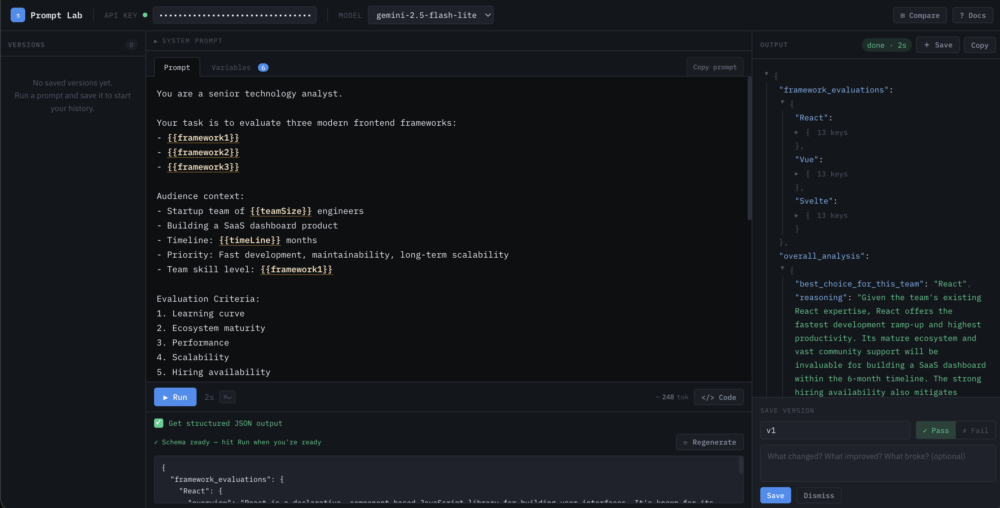

# ⚗ Gemini Prompt Lab

**A free, open-source browser tool for testing, comparing and exporting Google Gemini AI prompts.**

[](https://geminipromptlab.vercel.app/)
[](LICENSE)
[]()
[]()



---

## What is this?

Gemini Prompt Lab is a single HTML file that runs entirely in your browser. No server, no build step, no npm install. Paste in your Gemini API key, write a prompt, and start iterating — with proper tooling around it.

Built originally to speed up prompt development for a personal project, it grew into a proper prompt engineering workbench.

**[→ Try it live](https://geminipromptlab.vercel.app/)**

---

## Features

### ✦ Prompt Variables
Write prompts with `{{variableName}}` tokens. Define values in the Variables tab. Live syntax highlighting shows every token in the editor. Cmd+Click (or Ctrl+Click) a token to jump straight to its value field.

### ✦ Side-by-Side Model Comparison
Click **⊞ Compare** to split the output panel into two panes. Pick any two Gemini models, hit **▶▶ Run Both**, and see responses in parallel — each with its own elapsed timer, status pill, copy button, and save button. Great for `gemini-2.5-flash-lite` vs `gemini-2.5-flash` speed/quality tradeoffs.

### ✦ Version History
Save any output as a named version with a pass/fail flag and annotation note. Restore any version to the editor instantly. Versions survive page refresh via `localStorage`. Compare-mode saves include an A/B badge in the sidebar.

### ✦ Structured JSON Output
Check **Get structured JSON output** to auto-generate a JSON schema from your prompt. Edit the schema freely before running. Responses render as a collapsible, syntax-highlighted JSON tree — click any node to expand or collapse.

### ✦ Code Export — 7 Languages
Click **</> Code** in the run toolbar to open the export modal.

- **Default mode** — prompt values injected, ready to copy and run
- **With variables mode** — variables declared at the top by name, prompt uses language-native interpolation

Supported languages: **JavaScript · TypeScript · Python · Dart · Kotlin · Swift · Go**

### ✦ Grounding / Search Sources
If the model returns grounding metadata (e.g. with search-enabled models), clickable source chips appear below the output.

### ✦ System Prompt
Collapsible system prompt field. Included in all API calls and code exports when set.

### ✦ Live Token Counter
Rough real-time token estimate as you type. Turns amber at 50k tokens, red at 100k.

---

## Getting Started

### Option 1 — Use the live version
Go to **[geminipromptlab.vercel.app](https://geminipromptlab.vercel.app/)** — nothing to install.

### Option 2 — Run locally
```bash
git clone https://github.com/avithe1/geminipromptlab.git
cd geminipromptlab
open index.html   # or just double-click the file
```

That's it. No `npm install`. No build step. No server.

### Getting a Gemini API Key
1. Go to [aistudio.google.com](https://aistudio.google.com/)
2. Click **Get API key**
3. Paste it into the **API Key** field in the Prompt Lab header

Your key is stored only in your browser's `localStorage` and sent exclusively to Google's API — never anywhere else.

---

## Keyboard Shortcuts

| Shortcut | Action |
|---|---|
| `⌘↵` / `Ctrl+Enter` | Run prompt (or Run Both in compare mode) |
| `Cmd+Click` / `Ctrl+Click` on `{{var}}` | Jump to variable value |
| `Tab` | Cycle autocomplete options |
| `Enter` | Select highlighted autocomplete option |
| `↑ ↓` | Navigate autocomplete options |
| `Esc` | Dismiss autocomplete / close modal |

---

## Supported Models

| Model | Notes |
|---|---|
| `gemini-2.5-flash` | Best quality |
| `gemini-2.5-flash-lite` | Fastest, cheapest — good default |
| `gemini-2.0-flash` | Stable, widely available |
| `gemini-3.0-flash` | Latest preview |

---

## Project Structure

```
geminipromptlab/
├── index.html        # The entire application — HTML, CSS, JS in one file
├── og-image.png      # Open Graph image for social sharing (1200×630px)
├── README.md         # You are here
└── LICENSE           # MIT
```

No build tools. No frameworks. No bundler. Intentionally kept as a single file so it's trivially deployable anywhere static files are served.

---

## Deploying Your Own Instance

Since it's a single HTML file, deployment is trivial on any static host.

**Vercel**
```bash
vercel deploy
```

**Netlify**
Drag and drop `index.html` onto [netlify.com/drop](https://app.netlify.com/drop).

**GitHub Pages**
Push to a repo, enable Pages from the repo settings, done.

**Locally**
Double-click `index.html`.

---

## Contributing

Contributions are welcome. Here's how to get started:

1. Fork the repo
2. Create a branch — `git checkout -b feature/your-feature-name`
3. Make your changes to `index.html`
4. Open a pull request with a clear description of what changed and why

Since the whole app lives in one file, there's no build process to worry about. Open `index.html` in a browser, make a change, refresh — that's the dev loop.

**Ideas for contributions:**
- Diff view between compare pane outputs
- Batch testing (run one prompt against multiple variable values)
- Additional language targets in code export
- `curl` / Postman export format
- Dark/light theme toggle

Please open an issue first for larger changes so we can discuss the approach before you invest time building it.

---

## Data & Privacy

- Your API key is stored in `localStorage` in your own browser — nowhere else
- Prompt text, versions, and variables are stored in `localStorage` — they never leave your machine
- The only external requests made are to Google's Gemini API (`generativelanguage.googleapis.com`) and Google Fonts
- No analytics, no tracking, no ads

---

## License

MIT © [avithe1](https://github.com/avithe1)

See [LICENSE](LICENSE) for full text.

---

Built with zero dependencies · Runs in your browser · Free forever
